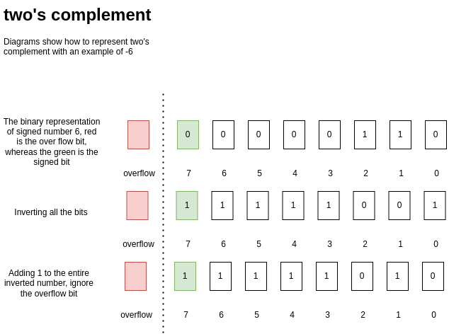
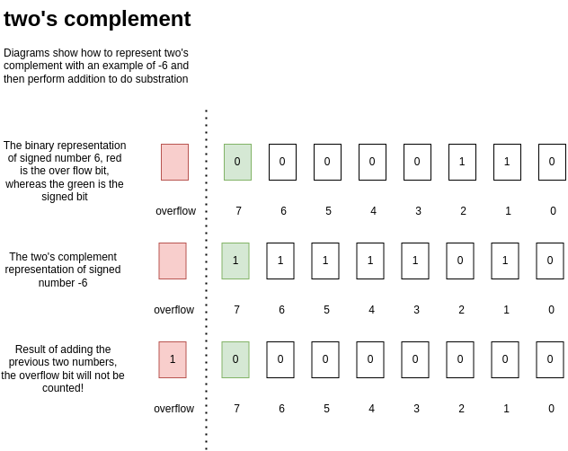
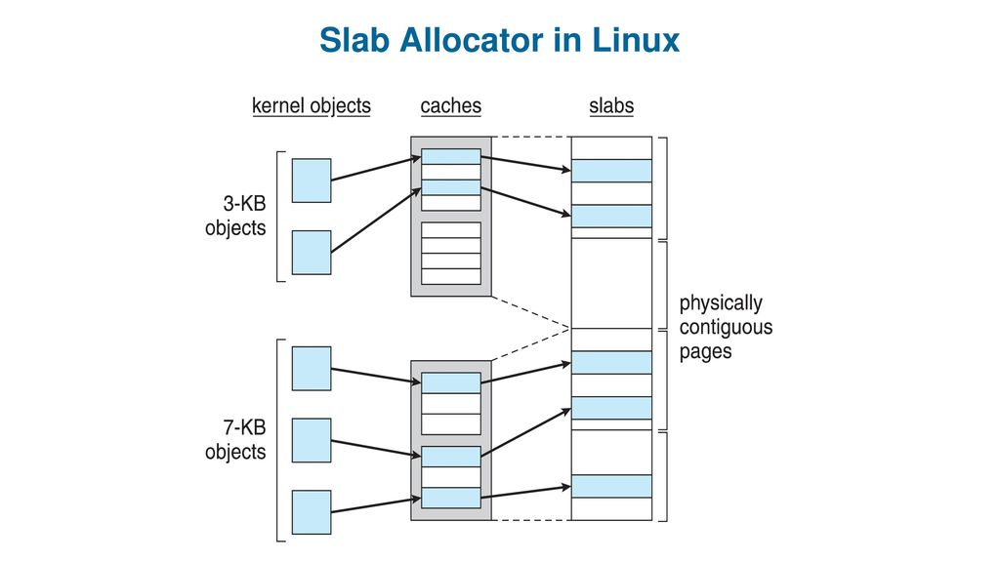
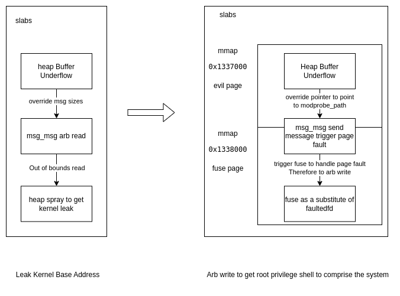
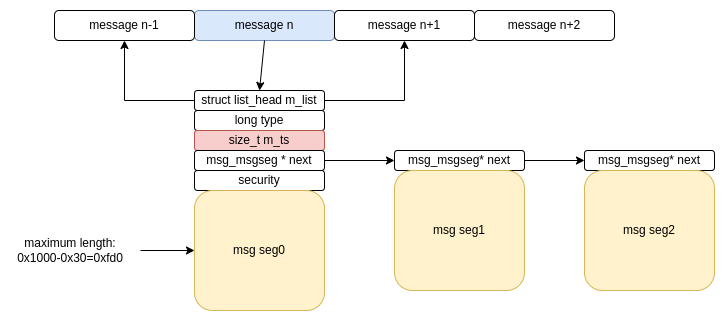
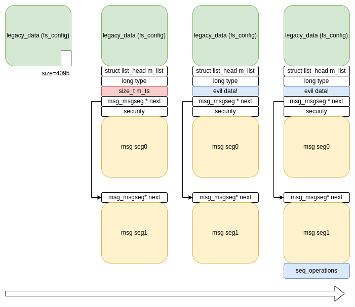

# CVE-2022-0185-Case-Study

This case study is a result of an assignment of ECE 9069: Introduction to Hacking : https://whisperlab.org/introduction-to-hacking/

# CVE-2022-0185 Overview

CVE-2022-0185 is a heap-based buffer overflow flaw was found in the way the  legacy_parse_param function in the Filesystem Context functionality of  the Linux kernel verified the supplied parameters length. An  unprivileged (in case of unprivileged user namespaces enabled, otherwise needs namespaced CAP_SYS_ADMIN privilege) local user able to open a  filesystem that does not support the Filesystem Context API (and thus  fallbacks to legacy handling) could use this flaw to escalate their  privileges on the system. [1]

After this vulnerability was reported, patch has been released to fix this bug:

https://git.kernel.org/pub/scm/linux/kernel/git/torvalds/linux.git/commit/?id=722d94847de2

https://ubuntu.com/security/CVE-2022-0185#impact-score

There is a detailed writeup from the explorer:  https://www.hackthebox.com/blog/CVE-2022-0185:_A_case_study

In this repository I will explain the basic steps and related background information to reproduce this vulnerability. Also, if there are anything you feel unclear, you can send me an exmail:dcheng69@uwo.ca I am rather happy to answer the question.

# 1. Introduction

The CVE-2022-0185 vulnerability was published on 02/11/2022, with a CVSS 3.x base score of 8.4 (High).[1] This vulnerability is a heap-based buffer overflow, caused by an unsigned integer underflow.

The vulnerability was introduced in the Linux v5.1 kernel, affecting all Linux distributions with kernel versions higher than 5.1. For example, Ubuntu 20.04 LTS (focal) was vulnerable to this bug. However, a patch was released and is available since version 5.4.0-96.109 .[3] 

Exploiting this vulnerability allows an unprivileged local user to escalate their privileges on the system, potentially compromising the entire system.[1] [2] 
Here is a detailed analysis of the CVSS score:
Base Score: 8.4, indicating a significant security risk that requires immediate attention.
Impact Score: 5.9, suggesting substantial potential damage if exploited. The high confidentiality, integrity, and availability values contribute to this score.
Exploitability Score: 2.5, suggesting relatively high exploitability. The local Attack Vector, high integrity , and high availability values contribute to this score.

Table 1.1 and Table 1.2 provide more information on these scores and their components.

| **CVSS v3.1 Severity** | **Value** |
| ---------------------- | --------- |
| Base Score             | 8.4 HIGH  |
| Impact Score           | 5.9       |
| Exploitability Score   | 2.5       |

**Table 1.1 CVSS Severity Scores[1]**

| **CVSS v3.1 Metrics**    | **Value** |
| ------------------------ | --------- |
| Attack Vector (AV)       | Local     |
| Privileges Required (PR) | None      |
| User Interaction (UI)    | None      |
| Confidentiality (C)      | High      |
| Integrity (I)            | High      |
| Availability (A)         | High      |

**Table 1.2 CVSS Vector[1]**

# 2. Background and Related Concepts

## 2.1 Unsigned Number Underflow

### 2.1.1 Two’s Complement

There are two integer types in modern computers, signed and unsigned. The representation of signed number generally involves an operation called two’s complement.[4] “Two’s complement uses the binary digit with the greatest place value as the sign to indicate whether the binary number is positive or negative”[4]

Introducing the two’s complement will convert the calculation of subtraction into addition therefore simplify the design and implementation of CPU. The generate of two’s complement of an integer involves three steps:[4]

- Step 1: “Starting with the binary representation of the number, with the leading bit being a signed bit”;
- Step 2: “Inverting all bits”;
- Step 3: “Adding 1 to the entire inverted number, ignore any overflows”

Fig 2.1.1.1 shows the converting process in a diagram with an actual example of converting “-6” to its two’s complement format.



**Fig 2.1.1.2 Addition Using Two’s Complement**

Figure 2.1.1.2 shows the process of adding the two's complement of '-6' to '+6'. This demonstrates how using two's complement allows addition to be used as a substitute for subtraction.



**Fig 2.1.1.2 Addition Using Two’s Complement**

### 2.1.2 Number Representation in RAM

From Section 2.1.1, we already understand what two's complement is. Now, let's take a look at the scenario of unsigned number underflow in computers. In modern computers, when using unsigned numbers, the most significant bit is not treated as a signed bit; instead, it is part of the unsigned number itself. This situation means that when performing subtraction with an unsigned number, we must be cautious, as it may lead to a condition known as unsigned number underflow.[5]

Fig 2.1.2.1 illustrates the situation of subtracting 6 from 5 for an 8-bit unsigned number. The final result is 255 due to the unsigned number wrapping around. When this underflow occurs in a conditional statement, it has the potential to disrupt the functionality of the statement.


**Fig 2.1.2.1 Unsigned Number Underflow**

## 2.2 Linux Kernel Memory

### 2.2.1 Slabs in Heap Memory

In the Linux kernel, the Slab Allocator is a memory management mechanism used for efficient allocation and deallocation of small chunks of memory. It provides performance by maintaining several caches of Slabs, each containing fixed-size memory blocks. Typically, kmalloc-32 allocates 32 bytes of memory, it is a kmalloc-32 slab, whereas, kmalloc-4k allocate 4096 bytes of memory, it is a kmalloc-4k slab.[6]

Furthermore, slab allocation in the Linux kernel typically involves allocating memory from a contiguous address space within the kernel’s heap memory region. This contiguous address is managed by the kernel and is used to allocate memory for various kernel objects and data structures. Fig 2.2.1.1 shows the layout of slabs in LInux kernel memory.



**Fig 2.2.1.1 Slab Allocator in Linux [7]** (This author of this figure is https://leviathan.vip/)

# 3 Technical Analysis of the Vulnerability

## 3.1 Proof of Concept

If you want to reproduce the process with a self compiled linux kernel please read the following markdown files to get the background information:

1. First read the markdown on how to compile a Linux Kernel: https://github.com/dcheng69/CVE-2022-0185-Case-Study/blob/main/compile_linux/compile.md
2. Then read the markdown about how to prepare a ram file system to perform the POC: https://github.com/dcheng69/CVE-2022-0185-Case-Study/blob/main/ramfs/ramfs.md
3. Finally follow the poc markdown: https://github.com/dcheng69/CVE-2022-0185-Case-Study/blob/main/Poc/poc.md

**Note**:

All the markdown files as well as the code and script are in different folders of this repository, each folder comes with its own markdown file, read it before trying to do something!

### 3.1.1 Unsigned Underflow in Kernel

In section 2.1, we explained how unsigned underflow works. Now, we will examine the kernel function that contains this vulnerability.

User “clubby789” discovered a vulnerability in the kernel function legacy_parse_param . This function is primarily responsible for parsing parameters passed to the kernel. In CVE-2022-0185, it was invoked after using fsopen to open a file descriptor, followed by using the fsconfig function to pass the configuration key-value pairs to the kernel. A simplified version of legacy_parse_param is shown in the following code. [2]

```c
static int legacy_parse_param(struct fs_context *fc, struct fs_parameter *param) {
	struct legacy_fs_context *ctx = fc->fs_private;	// [1]
	unsigned int size = ctx->data_size;			// [2]
	size_t len = 0;
	int ret;
	[ ... ]
	switch (param->type) {
	case fs_value_is_string:
		len = 1 + param->size;				// [3]
	case fs_value_is_flag:
		len += strlen(param->key);
		break;
	default:
		return invalf(fc, "VFS: Legacy: Parameter type for '%s' not supported", param->key);
	}
	if (len > PAGE_SIZE-2-size) return invalf(fc, "VFS: Legacy: Cumulative options too large"); // [4]
	[ ... ]
	if (!ctx->legacy_data) {
		ctx->legacy_data = kmalloc(PAGE_SIZE, GFP_KERNEL);	// [5]
		if (!ctx->legacy_data) return -ENOMEM;
	}
	ctx->legacy_data[size++] = ',';      // [6]
	len = strlen(param->key);
	memcpy(ctx->legacy_data + size, param->key, len);
	size += len;
	if (param->type == fs_value_is_string) {
		ctx->legacy_data[size++] = '=';
		memcpy(ctx->legacy_data + size, param->string, param->size);
		size += param->size;
	}
	ctx->legacy_data[size] = '\0';
	ctx->data_size = size;
	ctx->param_type = LEGACY_FS_INDIVIDUAL_PARAMS;
	return 0;
}
```

From above code snippet, we can see that lines [1] and [2] set up the context of the code, while line [4] contains the statement where unsigned underflow occurs. Line [5] handles heap slab allocation, and lines [6] and [7] are responsible for populating data into the allocated slab. Notably, line [6] adds a comma (',') as a separate delimiter, and an equals sign ('=') is also added, resulting in two extra bytes beyond the actual data size.

In line [4], the variables inside the if statement contain PAGE_SIZE (a macro set to 4096) and size (an unsigned 64-bit number). When an unsigned number accumulates to 4095, underflow occurs, causing the if statement to always evaluate to false. This allows for an out-of-bounds write to the neighboring slab. The underflow is caused by subtracting an unsigned number, resulting in 4096 - 4095, which yields an unsigned number of 18446744073709551615.[2]

The result of `18446744073709551615` is explained in the following text:

```c
if (len > PAGE_SIZE-2-size) return invalf(fc, "VFS: Legacy: Cumulative options too large");
```

Notice that, here the `PAGE_SIZE` equals to `4096` bytes, and the `2` equals to the character `,` and `=` added to separate each `key-value` pair. The issue is that `size` is an **unsigned value**, thus when size reach `4095`, the statement of `PAGE_SIZE-2-size` will equals to **`singned value: -1`**, however for **unsigned value: 18446744073709551615** because the 2's complement as shown in the following diagram! [3]

  

Therefore the above if statement will always be false, which means we the rest of the data will copy to the heap beyond the slab we allocated!


### 3.1.2 POC code analysis

After understanding how this unsigned number underflow can occur, we can proceed to build a proof of concept (POC) code to demonstrate the vulnerability.

User “clubby789” provides us with a detailed POC code, shown in the following code snippet. The code is concise; it first opens a file descriptor called ext4, then uses fsconfig multiple times to populate data to the kernel.

Two things to notice here:

- Invoking fsopen to open ext4 requires CAP_SYS_ADMIN privileges. Therefore, in a later exploit, we would use unshare to obtain these privileges. However, for this proof of concept (POC), we will simply run the program with root privileges.
- Each key-value pair we populate to the kernel has a length of 33. However, the function legacy_parse_param inserts a comma (',') at the beginning and an equals sign ('=') between the key and value. As a result, the actual size occupied for each cycle is 35.

```c
#define _GNU_SOURCE
#include <sys/syscall.h>
#include <stdio.h>
#include <stdlib.h>
#ifndef __NR_fsconfig
#define __NR_fsconfig 431
#endif
#ifndef __NR_fsopen
#define __NR_fsopen 430
#endif
#define FSCONFIG_SET_STRING 1
#define fsopen(name, flags) syscall(__NR_fsopen, name, flags)
#define fsconfig(fd, cmd, key, value, aux) syscall(__NR_fsconfig, fd, cmd, key, value, aux)
int main(void) {
    char* key = "AAAAAAAAAAAAAAAAAAAAAAAAAAAAAAAAA";  // 33 characters [1]
    int fd = 0;
    fd = fsopen("ext4", 0);  // [2]
    if (fd < 0) {
        puts("Open failed!\n");
        exit(-1);
    }
    for (int i = 0; i < 130; i++) {
        fsconfig(fd, FSCONFIG_SET_STRING, "\x00", key, 0);  //[3]
    }
    return 0;
}
```

In section 3.1.1, we mentioned that 4095 bytes of data must be populated before observing the out-of-bounds write. Given that each cycle only populates 35 bytes, we must perform the operation 117 times (4095 / 35) before observing the heap memory to complete the proof of concept.

### 3.1.3 POC with QEMU

In this repository: GitHub - dcheng69/CVE-2022-0185-Case-Study, we have provided a shell script called poc.sh to facilitate the debugging process. Please read the markdown file in the Poc folder before beginning setup.

Since legacy_parse_param is a kernel function, you will need to debug a kernel function. To do this, you need to compile the kernel source to obtain the necessary symbols and source code. We have also provided a detailed markdown file to guide you through the process. Please refer to the Compile_linux folder for more details.

In Fig. 3.1.3.1, we demonstrated that after populating 4095 bytes of data into the kernel heap, we successfully triggered an out-of-bounds write by exploiting unsigned underflow. Additionally, we populated a total of 4130 bytes of data into a kmalloc-4k slab, successfully corrupting the neighboring slab. Although in this example the neighboring slab contains no information (all zeros), we can carefully construct our code to leverage this feature for writing malicious data. We will demonstrate how to achieve this in the 3.2 Exploit section.


**Fig 3.1.3.1 POC with QEMU**

For more details please refer to https://github.com/dcheng69/CVE-2022-0185-Case-Study/blob/main/Poc/poc.md under the `Poc` folder of this repository!


## 3.2 Exploit

After knowing this vulnerability, we can move on to use this to do a exploit, details of which are documented under folder `exploit-ubuntu` and also this markdown file: https://github.com/dcheng69/CVE-2022-0185-Case-Study/blob/main/explot-ubuntu/exploit.md

In short, we compiled Ubuntu source code, get deb file, then we test it on a virtual machine to get specific kernel version. Then we modify the offset of the exploit code to targeting the kernel version using the information we found from `System.map` file. Finally we update grub and reboot to exploit!

### 3.2.1 Exploit Overview

User 'clubby789' provides us with a detailed exploit code. We will begin with an overview, followed by explanations of several key concepts using diagrams. Finally, we will present the exploit results using Ubuntu running on a virtual machine (VirtualBox).

After demonstrating the proof of concept for this vulnerability, we can now proceed to exploit it. In Fig. 3.2.1.1, an overview of how to exploit this vulnerability is illustrated:

- The left section focuses on obtaining the Linux kernel base address. This is achieved by exploiting unsigned underflow to override the msg_msg structure's m_ts, allowing us to read out of bounds and access previously sprayed kernel structures.
- The right section aims to gain root privileges. This is accomplished by using unsigned underflow to override the next pointer of the msg_msg structure, pointing it to modprobe_path. We then trigger a page fault that invokes our constructed fuse code, enabling arbitrary writes in kernel space.



**Fig 3.2.1.1 Overview of Exploit**


### 3.2.2 Get Linux Kernel Base Address

As analyzed earlier, we will exploit unsigned underflow in this part to override the m_ts field of the msg_msg structure, enabling an out-of-bounds read. By spraying the heap with structures containing kernel pointers, we can hopefully obtain a memory leak.

The struct msg_msg is a data structure in the Linux kernel that is used to implement System V message queues . In this section, we focus on the internal structure of struct msg_msg and the logic of functions related to sending, receiving, and allocating messages. As shown in Fig. 3.2.2.1, these are the functions we need to understand.

The struct msg_msg is a data structure in the Linux kernel used to implement System V message queues.[8] In this discussion, we focus on the internal structure of struct msg_msg, along with the logic of functions related to sending, receiving, and allocating messages. As shown in Fig. 3.2.2.1, these are the functions we need to understand."

The implementation of sending messages is located in the msg.c file, which defines the maximum length of a message as 8192 bytes. In the alloc_msg function, messages are divided into segments based on their length. If the length of the message, along with the message header, exceeds one page (4096 bytes), the message will be stored in several segments linked together by pointers. 


**Fig 3.2.2.1 struct msg_msg send and receive**

In Fig. 3.2.2.2, we can see that the struct msg_msg serves as a message header, occupying 0x30 bytes of memory. If there is residual data in the message, it will be stored in message segments and linked to struct msg_msgseg. Therefore, if the kernel allows messages up to a maximum of 8192 bytes, the data will be stored in a maximum of three message segments.


**Fig 3.2.2.2 struct msg_msg**

In Fig. 3.2.2.3, we illustrate the structure of struct msg_msg. From the code, we know that the m_ts field is the one we need to override to read out of bounds. (You can find the draw.io source file under `res` folder if you need!)



**Fig 3.2.2.2 struct msg_msg structure**

Now that we understand the structure of struct msg_msg, we need to learn how to obtain a kernel leak. The Linux kernel has a Kernel Address Space Layout Randomization (KASLR) feature, which means the kernel code is loaded at a random address decided during the boot phase. However, the offset from the kernel's starting point to any function address remains constant, allowing us to perform specific operations to fill heap space with structures containing particular kernel functions. By decreasing the offset, we can find the kernel start address.

Fortunately, we can easily spray the heap with seq_operations structures by opening /proc/self/stat, which resides in kmalloc-32 slabs. The definition of seq_operations is shown in Fig. 3.2.2.3.


**Fig 3.2.2.3 Structs for Kernel Leak**

Finally, the overall process is depicted in Fig. 3.2.2.4. We begin by populating the legacy_data with 4095 bytes of data to prepare for the override. Then, we construct messages using struct msg_msg. Because heap memory is allocated continuously, the constructed messages will likely be adjacent to the neighboring kmalloc-4k slab. We override the m_ts field by controlling the data we write to the legacy_data.

Next, we spray the heap with multiple kmalloc-32 seq_operations structures. We then receive data from the message queue, which triggers an out-of-bounds read. By adjusting the offset from the kernel function, we can obtain the kernel base address.



**Fig 3.2.2.3 Overview of Out of Bound Read**

### 3.2.3 Get Root Privilege

Similar to our earlier analysis, in this part, we need to set up a FUSE file system, which allows our userspace code to handle page faults from kernel space. At the same time, we will override the msg_msgseg *next pointer to point to modprobe_path, enabling arbitrary writes in kernel space.

Let's first examine the FUSE call stack depicted in Fig. 3.2.3.1. In general, FUSE allows us to implement a file system in user space. When there is a new operation, the system will invoke the code we defined for FUSE!


**Fig 3.2.3.1 Fuse Overview**

Let's analyze how to use FUSE to achieve arbitrary writes in kernel space. First, let's consider the send message operation for struct msg_msg. This operation involves writing data to kernel space. If we construct the message to have two segments, we can override the pointer and write to any kernel address. This concept is illustrated in Fig. 3.2.3.2.

Additionally, after examining the logic of sending messages to the queue, we know that the process involves copying a buffer from user space to kernel space. If the messages are long enough, they will be copied segment by segment. If we can trigger a page fault during this process, we can achieve the scenario shown in Fig. 3.2.3.2.

Fortunately, FUSE provides the necessary functionality. We can map a page to FUSE, and when a page fault is triggered, the system will call our FUSE read function to handle the page fault. By pausing the read process until the unsigned underflow overrides the msg_msg_seg *next pointer and then resuming the send message process, we can achieve arbitrary writes. The entire process is demonstrated in Fig. 3.2.3.3.


**Fig 3.2.3.2 Using Send Message**


**Fig 3.2.3.3 Fuse and Send Message**

### 3.2.4 Exploit with virtual box

Following the markdown file of: https://github.com/dcheng69/CVE-2022-0185-Case-Study/blob/main/explot-ubuntu/exploit.md

Once the compilation is complete, you can observe the results of the exploit in Fig. 3.2.4.1.


**Fig 3.2.4.1 Virtual Box Exploit**

# 4. Mitigation of the Vulnerability

## 4.1 Official Patches

After this vulnerability was reported, Linux and its many distributions merged patches to fix this bug.[9] [10] [11]

In the following screenshot, we show the patch merged by Linus Torvalds. The mitigation of this underflow problem is simply to convert the subtraction operation to addition.


# 5. Real-word Impact

In this report, we demonstrate how this vulnerability can be exploited to compromise an Ubuntu system. Additionally, it can potentially target older systems that lack regular security updates.

Regarding Kubernetes, this vulnerability could result in privilege escalation, container escape, or denial of service attacks.

While there have been no reported losses caused by this vulnerability in the news, it underscores the importance of consistently applying critical security updates. The researcher who reported this vulnerability exemplifies ethical hacking practices that we should all strive to uphold.[12]

# Reference

[1] https://nvd.nist.gov/vuln/detail/CVE-2022-0185

[2] https://www.hackthebox.com/blog/CVE-2022-0185:_A_case_study

[3] https://ubuntu.com/security/CVE-2022-0185#impact-score

[4] [https://en.wikipedia.org/wiki/Two%27s_complement](https://en.wikipedia.org/wiki/Two's_complement)

[5]https://www.gnu.org/software/c-intro-and-ref/manual/html_node/Unsigned-Overflow.html

[6] https://www.kernel.org/doc/gorman/html/understand/understand011.html

[7] https://leviathan.vip/

[8] https://www.willsroot.io/2021/08/corctf-2021-fire-of-salvation-writeup.html

[9] https://git.kernel.org/pub/scm/linux/kernel/git/torvalds/linux.git/commit/?id=722d94847de2

[10] https://ubuntu.com/security/CVE-2022-0185

[11] https://access.redhat.com/security/cve/CVE-2022-0185

[12]https://jfrog.com/blog/the-impact-of-cve-2022-0185-linux-kernel-vulnerability-on-popular-kubernetes-engines/

[14] https://github.com/chenaotian/CVE-2022-0185?tab=readme-ov-file

[15] https://www.tutorialspoint.com/two-s-complement