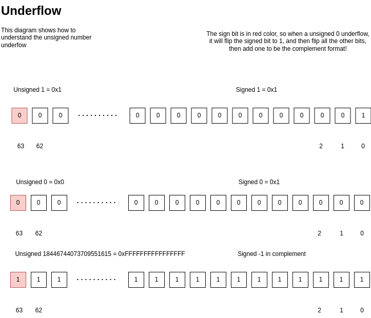

# CVE-2022-0185-Case-Study

## CVE-2022-0185 Overview

CVE-2022-0185 is a heap-based buffer overflow flaw was found in the way the  legacy_parse_param function in the Filesystem Context functionality of  the Linux kernel verified the supplied parameters length. An  unprivileged (in case of unprivileged user namespaces enabled, otherwise needs namespaced CAP_SYS_ADMIN privilege) local user able to open a  filesystem that does not support the Filesystem Context API (and thus  fallbacks to legacy handling) could use this flaw to escalate their  privileges on the system. [1]

After this vulnerability was reported, patch has been released to fix this bug:

https://git.kernel.org/pub/scm/linux/kernel/git/torvalds/linux.git/commit/?id=722d94847de2

https://ubuntu.com/security/CVE-2022-0185#impact-score

There is a detailed writeup from the explorer:  https://www.hackthebox.com/blog/CVE-2022-0185:_A_case_study

In this repository I will explain the basic steps and related background information to reproduce this vulnerability. Also, if there are anything you feel unclear, you can send me an exmail:dcheng69@uwo.ca I am rather happy to answer the question.

## POC

Now we take a look at the analysis of this vulnerability from this writeup: https://www.hackthebox.com/blog/CVE-2022-0185:_A_case_study

From above link, we take a look at the function where happens the unsigned integer underflow:

```c
static int legacy_parse_param(struct fs_context *fc, struct fs_parameter *param) {
	struct legacy_fs_context *ctx = fc->fs_private;	// [1]
	unsigned int size = ctx->data_size;			// [2]
	size_t len = 0;
	int ret;
	[ ... ]
	switch (param->type) {
	case fs_value_is_string:
		len = 1 + param->size;				// [3]
	case fs_value_is_flag:
		len += strlen(param->key);
		break;
	default:
		return invalf(fc, "VFS: Legacy: Parameter type for '%s' not supported", param->key);
	}
	if (len > PAGE_SIZE-2-size) return invalf(fc, "VFS: Legacy: Cumulative options too large"); // [4]
	[ ... ]
	if (!ctx->legacy_data) {
		ctx->legacy_data = kmalloc(PAGE_SIZE, GFP_KERNEL);	// [5]
		if (!ctx->legacy_data) return -ENOMEM;
	}
	ctx->legacy_data[size++] = ',';      // [6]
	len = strlen(param->key);
	memcpy(ctx->legacy_data + size, param->key, len);
	size += len;
	if (param->type == fs_value_is_string) {
		ctx->legacy_data[size++] = '=';
		memcpy(ctx->legacy_data + size, param->string, param->size);
		size += param->size;
	}
	ctx->legacy_data[size] = '\0';
	ctx->data_size = size;
	ctx->param_type = LEGACY_FS_INDIVIDUAL_PARAMS;
	return 0;
}
```

First, the system call `fsopen` creates a new file system context, which a user can mount a new file system. (For ubuntu, you can check the /etc/fstab for examples) `9p` or `ext4` are the two types of file systems that will trigger this vulnerability. After the setup of the context for the file system, we can use `fsconfig` to pass `key-value` pairs to store in the heap memory.

The unsigned integer underflow happened at the following `if condition`, this statement meant to prevent buffer overflow by checking the limits of the data filed and the slab free spaces.

```c
if (len > PAGE_SIZE-2-size) return invalf(fc, "VFS: Legacy: Cumulative options too large");
```

Notice that, here the `PAGE_SIZE` equals to `4096` bytes, and the `2` equals to the character `,` and `=` added to separate each `key-value` pair. The issue is that `size` is an **unsigned value**, thus when size reach `4095`, the statement of `PAGE_SIZE-2-size` will equals to **`singned value: -1`**, however for **unsigned value: 18446744073709551615** because the 2's complement as shown in the following diagram! [3]

  

Therefore the above if statement will always be false, which means we the rest of the data will copy to the heap beyond the slab we allocated!

**For the poc of this part please refer to the markdown file in poc folder for details!**

## Exploit

After knowing this vulnerability, we can move on to use this to do a exploit, details of which are documented under folder exploit linux.

We compiled Ubuntu source code, get deb file, then we test it on a virtual machine to get specific kernel version. Then we modify the offset of the exploit code to targeting the kernel version using the information we found from `System.map` file. Finally we update grub and reboot to exploit!

# Reference 

[1] https://nvd.nist.gov/vuln/detail/CVE-2022-0185

[2] https://github.com/chenaotian/CVE-2022-0185?tab=readme-ov-file

[3] https://www.tutorialspoint.com/two-s-complement