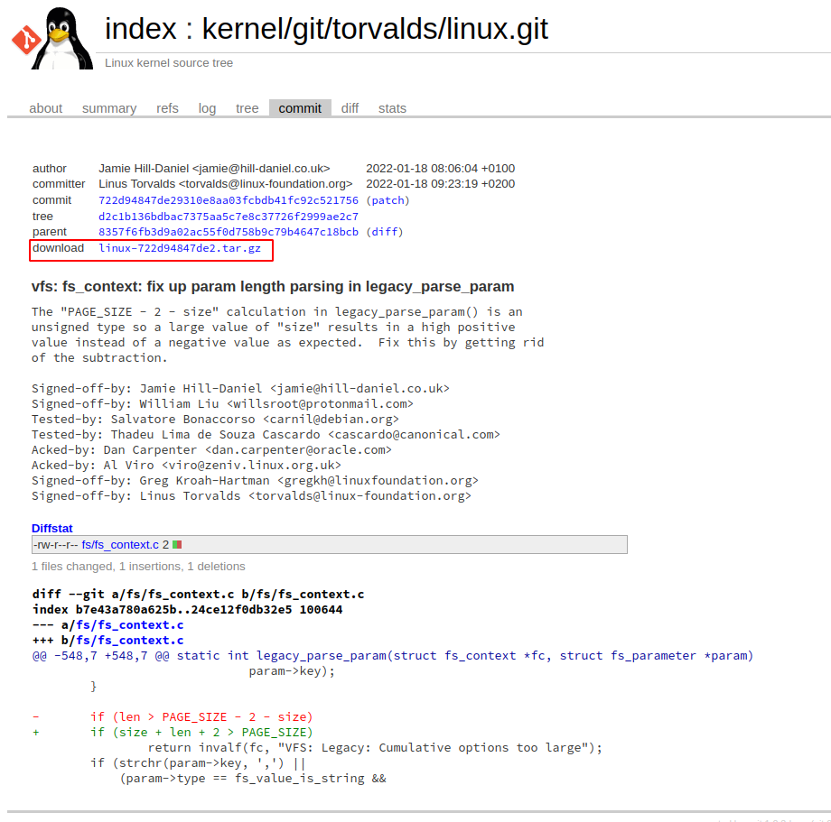

# Compile Linux From Source

There are many reasons for you to compile linux from source, just for fun or for study purpose.....

There are differences between the compiling Linux Kernel alone and Linux distributions like Ubuntu. The former one is smaller, while the later one contains extra code for applications.

Here I will introduce both, but you can always find the information on the official wiki site:

https://wiki.ubuntu.com/Kernel/BuildYourOwnKernel

https://www.kernel.org/doc/html/latest/admin-guide/README.html

## Compile Linux

### Compile Env setup

Environment setup:

```bash
sudo apt-get update
sudo apt-get install build-essential libncurses-dev bison flex libssl-dev libelf-dev
```

### Download the Source Code

Then, we can go to the link where the patch fixed the vulnerability: https://git.kernel.org/pub/scm/linux/kernel/git/torvalds/linux.git/commit/?id=722d94847de2

download the `linux-722d94847de2.tar.gz`



After you download the tarball, you extract it

```bash
# extract the files
tar -xvzf linux-722d94847de2
# enter the source file dir
cd linux-722d94847de2
```

### Config and Compile

Then if you are familiar with kernel configuration, you can run `make menuconfig` to trailer the kernel according to your needs. But if you just want to experience the default setup, simply run the following command

```bash 
# generate default config
make defconfig
# After this process, ".config" is generated in current directory
# you can take a look at this file if you want
```

**Note:**[1]

```bash
# Sometimes, you will have to make sure some settings are enabled
# In this circumstances, you can choose to edit the ".config" file
# Or you can do as following (for debug kernel):
cat <<EOF >.config-fragment
CONFIG_DEBUG_INFO=y
CONFIG_DEBUG_KERNEL=y
CONFIG_GDB_SCRIPTS=y
EOF
./scripts/kconfig/merge_config.sh .config .config-fragment
```

After generate the Configuration files ".config", you simply just use the following command to compile

```bash
# Number 8 indicates 8 threads, don't exceed your cpu nums
# You can also indicate the output dir by "-O" flag
make -j8

# The compilation will take some time
# After compilation, you can find bzImage in following path
./arch/x86
```

**Note**: the path may vary according to the architecture you are targeting!

## Compile Ubuntu

### Compile Env setup

The process of building Ubuntu from source will take longer!

Environment Setup:

```bash
# build dependencies for the version of kernel you want to compile
# Take linux-image-unsigned-5.11.0-44-generic for an example 
sudo apt build-dep linux linux-image-unsigned-5.11.0-44-generic
# Other dependencies
sudo apt install libncurses-dev gawk flex bison openssl libssl-dev dkms libelf-dev libudev-dev libpci-dev libiberty-dev autoconf llvm
```

**Note:**

If you experienced some package version that apt complains about, you can use `aptitude` instead, it will generate several solutions for you to choose!

### Download the Source Code

Following this guide: https://wiki.ubuntu.com/Kernel/Dev/KernelGitGuide

I will take focal release for an example(focal is for ubuntu 20.04 LTS).

```bash
git clone 	
https://git.launchpad.net/~ubuntu-kernel/ubuntu/+source/linux/+git/focal

```

Referencing this link for tags you want to targeting: https://git.launchpad.net/~ubuntu-kernel/ubuntu/+source/linux/+git/focal/refs/tags

```bash
# After cloning the whole repository
# you can always use "git tag -l 5.11.0-44" to verify
git checkout -b Ubuntu-hwe-5.11-5.11.0-44.48_20.04.2 Ubuntu-hwe-5.11-5.11.0-44.48_20.04.2
```

### Config and Compile

If you want to modify the configuration and you are clear of what to do, then just follow the "Modifying the configuration" section in this link: https://wiki.ubuntu.com/Kernel/BuildYourOwnKernel

Then we can move to compile process:

```bash
fakeroot debian/rules clean

# quicker build:
fakeroot debian/rules binary-headers binary-generic binary-perarch

# if you need linux-tools or lowlatency kernel, run instead:
fakeroot debian/rules binary
```

If the build is successful, several .deb binary package files will be produced in the directory above the build root directory. For example after building a kernel with version "4.8.0-17.19" on an amd64 system, these three (or more) .deb packages will be produced:

```bash
If the build is successful, several .deb binary package files will be produced in the directory above the build root directory. For example after building a kernel with version "4.8.0-17.19" on an amd64 system, these three (or more) .deb packages will be produced:
```

On later releases, you will also find a `linux-extra-` package which you should also install if present.

**Note:**

If you just want to update the current ubuntu to the kernel version you compiled, you can just install the following three debs

```bash
linux-image-unsigned-5.11.0-44-generic_5.11.0-44.48~20.04.2_amd64.deb
linux-modules-5.11.0-44-generic_5.11.0-44.48~20.04.2_amd64.deb
linux-modules-extra-5.11.0-44-generic_5.11.0-44.48~20.04.2_amd64.deb
```

In this folder, I contained all the debs I compiled for `Ubuntu-hwe-5.11-5.11.0-44.48_20.04.2` in the deb folder with no default configurations. You can simply run `sudo dpkg -i linux*.deb` to install them on your targeting system!

**Note:**

I would not recommend you install any debs not from the official source to your machine! I will recommend you set up a virtual machine with ubuntu 20.04 LTS installed to testify the debs I provided for reproduce the CVE-2022-0185!

# Reference

[1] https://stackoverflow.com/questions/11408041/how-to-debug-the-linux-kernel-with-gdb-and-qemu