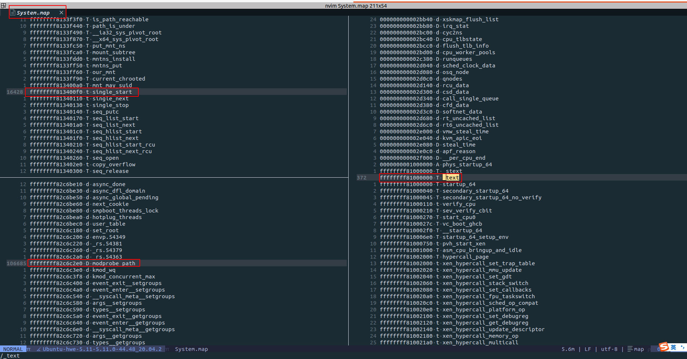
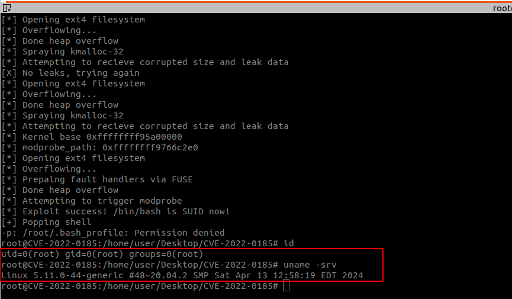

# Exploit

In this section we will use the exploit code provided by the reporter of the CVE-2022-0185 to testify on this vulnerability, make sure that we are working on a workable version of kernel source code: `Ubuntu-hwe-5.11-5.11.0-44.48_20.04.2`

Code Source: https://github.com/Crusaders-of-Rust/CVE-2022-0185?tab=readme-ov-file

**Note:**

If you don't want to compile the linux kernel by your self, then the exploit code provided by above link will directly run on `5.11.0-generic` official kernel

```bash
# Please do this on a virtual machine environemnt!
apt-get install linux-image-5.11.0-44-generic

# if you are familiar with grub, then just modify the /boot/grub/grub.cfg to start from the newly installed kernel
# Otherwise, i recommand using the GUI way
sudo apt install grub-customizer
# Then you just launch this app and choose the kernel version you want to boot, save and then exit reboot
```

## Virtual Machine Setup

As I said, I recommend you using a virtual machine to do this test!

I use the virtual box, and luckily ubuntu has provided us with a tutorial to show us how to install it : https://ubuntu.com/tutorials/how-to-run-ubuntu-desktop-on-a-virtual-machine-using-virtualbox#1-overview

After you doing this, put the `deb` files I upload in the `compile_linux/debs` folder, then install them

```bash
sudo dpkg -i linux*.deb
```

Then use `grub-customizer` or directly modify the `/boot/grub/grub.cfg` to boot from the kernel we just installed:


After you boot successfully, you should see the below output showing the correct version of kernel:


## Modify the Offsets

The code provided by the exploit github repo is designated for `linux-image-5.11.0-44-generic`, however we are using a self compiled image, the exploit will need to get a leak of kernel base address, therefore, we need to modify the offsets to be able to get a kernel base address.

**Note**:

Due to the `KASLR` configuration, the kernel base address will be randomised during boot phase, however, the offset of the kernel function to the kernel base address is still a fixed number. So the hacker would using some strut from the heap to decrease with its offset from the kernel base address, so that they can examine it when they get the leak.

Now we modify the offsets, the original github repo used the `seq_operations` to get the leak:

```c
struct seq_operations {
	void * (*start) (struct seq_file *m, loff_t *pos);
	void (*stop) (struct seq_file *m, void *v);
	void * (*next) (struct seq_file *m, void *v, loff_t *pos);
	int (*show) (struct seq_file *m, void *v);
};
```

So we need to get the `kernel_base` address as well as the `single_start` function address, and then calculate the offsets

There are two ways of doing this:

1. Directly using the booted kernel to check the `/proc/kallsyms`

This method would need a `root` privilege, and you then we know that the code are loaded in to the `_text` segment, so we can simply just look for `T _text` to get the current `kernel_base` address, and then we get the other two: `single_start`, `modprobe_path`.


Then we calculate and then replace the offsets into the original repo code:

```bash
git clone https://github.com/Crusaders-of-Rust/CVE-2022-0185.git

# enter the CVE-2022-0185 then edit the exploit_fuse.c file
....
int fd = -1;

uint64_t modprobe_path;
uint64_t offsets[] = {0x3400F0, 0x1C6C2E0}; # replace this will the offsets you calculated!
enum {SINGLE_START = 0, MODPROBE};
....
```

2. The second way of doing this rely on the compile output of the ubuntu kernel, find the `System.map` in the `/path-to-your-source/focal/debian/build/build-generic`



## Compile and Exploit

```bash
# After modify the offsets
make fuse
# explot!
./exploit
```



Now you can dive deeper to this problem since you have all the tools to study this exploit code! (This will have to thank the original author of the code!)

**Note:**

I know some of you might want a version that already there for you, so I also contained a version that has already been modified! Please refer to: https://github.com/Crusaders-of-Rust/CVE-2022-0185?tab=readme-ov-file for the original code!

# Reference

[1] https://www.hackthebox.com/blog/CVE-2022-0185:_A_case_study

[2] https://github.com/Crusaders-of-Rust/CVE-2022-0185?tab=readme-ov-file

[3] https://github.com/chenaotian/CVE-2022-0185?tab=readme-ov-file