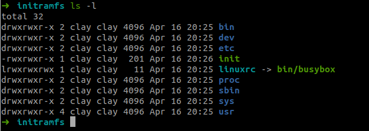
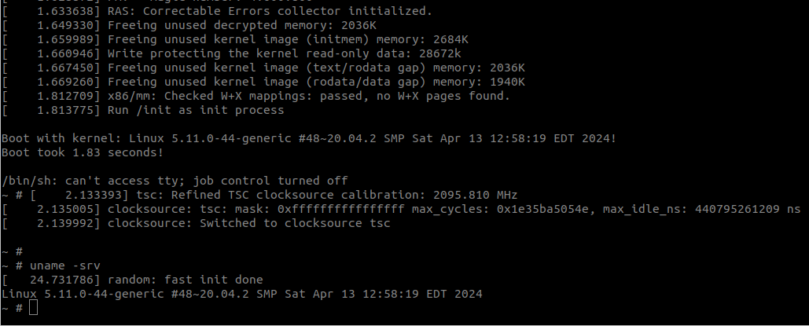

# Initramfs

## Background

An **initramfs** (niitial ram file system) is used to prepare Linux system during boot before the init process starts.[1] It is the solution introduced from Linux kernel 2.6 series. The idea is that a lot of initalisation magic done in the kernel that could be just as easily done in userspace.[2]

Similiar to the tinycore[3] Linux system, which is small enough to reside in the Ram.

In linux systems, before kernel 2.6, **initrd** was used. "In [Linux](https://en.wikipedia.org/wiki/Linux) systems, **`initrd`** (*initial [ramdisk](https://en.wikipedia.org/wiki/Ramdisk)*) is a scheme for loading a temporary root [file system](https://en.wikipedia.org/wiki/File_system) into [memory](https://en.wikipedia.org/wiki/Computer_memory), to be used as part of the [Linux startup process](https://en.wikipedia.org/wiki/Linux_startup_process). `initrd` and `initramfs` (from INITial RAM File System) refer to two different methods of achieving this. Both are commonly used to make preparations before the real [root](https://en.wikipedia.org/wiki/Root_directory) file system can be [mounted](https://en.wikipedia.org/wiki/Mount_(Unix))."[4]

## Use Case

initramfs can be used to debug linux operating system, when used with qemu as a hypervisor layer. In this repository, it can be used to provide a file system that small enough to reside in the ram therefore provide a running and debugging environment for our compiled linux kernel image.

In short, though it can be used to do a lot of cool stuff, but we only use it to debug and to do Poc(prove of concept) on linux kernel code here.

## Build Initramfs with Busybox

### BusyBox

Busybox is so popular, that you can simply just type "busybox" on your linux based machine to use it, but if you are seeking for a defination for it, then it will be "BusyBox is a software stuite that provides serveral Unix utilities in a single executable file"[5].  And you can find more infomration at this website: https://busybox.net/

### Compile BusyBox From Source

Here we need a file system, so we would build BusyBox from source code: (Thanks for these blogs for teaching me how to do this! [6] [7]) 

Set up the compile environemnt (Ubuntu as an example!)

```bash
sudo apt install -y build-essential libncurses-dev libelf-dev libssl-dev 
```


1. You can download whichever the most suitable for you, but I will simply choose  1_36_0 version  (https://busybox.net/downloads/)

   ```bash 
   wget https://github.com/mirror/busybox/archive/refs/tags/1_36_0.tar.gz
   # or you can simply use the one provided in this repo~
   tar -xvzf 1_36_0.tar.gz
   cd busybox-1_36_0
   ```

2. Then we set up the compile configuration for BusyBox, we can either compile a libc into our initramfs, or simply just compile the BusyBox staticly!  Here I will choose the later one. [7]

   ```bash
   # after cd busybox-1_36_0
   # generate default config [8]
   make defconfig
   # You will find .config file in current path
   # Modify .config file so that "CONFIG_STATIC=y"
   # Then use the following command to verify
   grep -nri "CONFIG_STATIC" .config
   ```

If you are familar with `make menuconfig` below is the option you need to turn on!


**Note:**

For a linux opearting system, normally a executable file is compiled using a **shared library**, which will be **libc**, to link the dependencies. But here we are providing code for a newly boot system, and if we use the shared library on our host machine, then when its running, it will locate to the wrong address and cause kernel to **panic**!


3. Then compile and install the output files to `_install` path

```bash
# 4 means four threads
make -j4
make install
# using ldd to verify if program staticlly linked
ldd _install/bin/busybox
# or
file _install/bin/busybox
```

### Build initramfs

Now we build the initramfs using `cpio`:

1. Create folders to store the structure of the file system.

```bash
# create folders
mkdir initramfs
mkdir -p initramfs/bin initramfs/sbin initramfs/etc initramfs/proc initramfs/sys initramfs/dev initramfs/usr/bin initramfs/usr/sbin
# copy file as well as soft links
cp -a busybox-1_36_0/_install/* ./initramfs
```

2. Then we create a `init` script, which will be run by the linux kernel after bootloader boot the kernel!

```bash
#!/bin/sh

mount -t devtmpfs devtmpfs /dev
mount -t proc none /proc
mount -t sysfs none /sys

cat <<!

Boot with kernel: $(uname -srv)!
Boot took $(cut -d' ' -f1 /proc/uptime) seconds!

!
exec /bin/sh
```

Then assign executable privilege to this script: `chmod +x init`



**Note:**

The initramfs replys on configration options `CONFIG_BLK_DEV_INITRD=y` and `CONFIG_INITRAMFS_SOURCE=""` when compiling the linux kernel! Thankfully, if you run `make defconfig`, this option will be automatically enabled!

3. Using cpio and gzip to create the final initramfs.cpio.gz file

```bash
find . -print0 | cpio --null -ov --format=newc | gzip -9 > ../initramfs.cpio.gz
```

## Test with Qemu

You can install qemu on ubuntu with `apt-get install qemu-system`. [9] We will use qemu to provide a hypervisor environment.

Then I am also good enough to provide you with a `bzImage` (self compiled from ubuntu source with kernel version `5.11.0-44-generic`) for you to test.

```bash
qemu-system-x86_64 -kernel bzImage \
    -initrd initramfs.cpio.gz -nographic \
    -append "console=ttyS0"
```



Type `Ctrl+a x` to exit!

# Reference

[1] https://wiki.gentoo.org/wiki/Initramfs

[2] https://wiki.ubuntu.com/Initramfs

[3] http://tinycorelinux.net/

[4] https://en.wikipedia.org/wiki/Initial_ramdisk

[5] https://en.wikipedia.org/wiki/BusyBox

[6] https://cylab.be/blog/320/build-a-kernel-initramfs-and-busybox-to-create-your-own-micro-linux

[7] https://cs.pynote.net/sf/linux/sys/202111123/

[8] https://busybox.net/FAQ.html#configure

[9] https://www.qemu.org/download/#linux